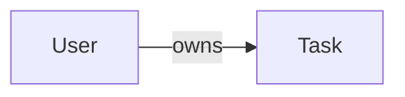

# 📝 To-do List Pro API

A multi-language challenge project for building a feature-rich task manager API with authentication, filtering, and data export.

This project is designed to be implemented in **multiple programming languages** (e.g., Node.js, Python, Go, Java) for learning, comparison, and portfolio purposes.

---

## 📦 Project Structure (Suggested)

todo-list-pro-api/
├── app/
│ └── controller/
│ └── model/
│ └── repository/
│ └── service/
└── ...

## 🔧 Technologies

Each implementation should aim to use:
- Restfull architecture
- JWT authentication
- ORM / Database access layer
- OpenAPI (Swagger) documentation
- Optional: Test suite

## ✅ Features

- JWT authentication
- CRUD for tasks and users
- Task filtering (status, priority, due date)
- Tags and task categorization
- Task export in JSON or CSV
- Secure: only users can access their own tasks

## 🧠 Entities


    
```mermaid
classDiagram
    class User {
        UUID id
        string name
        string email
        string password
        datetime created_at
    }

    class Task {
        UUID id
        UUID user_id
        string title
        string description
        enum status
        enum priority
        date due_date
        string[] tags
        datetime created_at
        datetime updated_at
    }
   ```

## 🔐 Authentication

### All protected routes require:
```makefile
Authorization: Bearer <JWT token>
```

## 🛠️ API Endpoints

### 🔐 Auth

| Method | Route          | Description         | Auth |
|--------|----------------|---------------------|------|
| POST   | /auth/register | Register new user   | ❌   |
| POST   | /auth/login    | Authenticate user   | ❌   |


### 👤 User

| Method | Route | Description      | Auth |
|--------|-------|------------------|------|
| GET    | /me   | Get logged user  | ✅   |


### ✅ Tasks

| Method | Route          | Description           | Auth |
|--------|----------------|-----------------------|------|
| GET    | /tasks         | List user’s tasks     | ✅   |
| POST   | /tasks         | Create a new task     | ✅   |
| GET    | /tasks/{id}    | Get task details      | ✅   |
| PUT    | /tasks/{id}    | Full update of task   | ✅   |
| PATCH  | /tasks/{id}    | Partial update of task| ✅   |
| DELETE | /tasks/{id}    | Delete a task         | ✅   |


#### Query Filters (on /tasks):
- **status:** pending, in_progress, done
- **priority:** low, medium, high
- **due_date:** YYYY-MM-DD
- **tags:** Comma-separated list

#### Example:
```bash
GET /tasks?status=pending&priority=high&due_date=2025-07-30&page=1&limit=10
```

### 📤 Export

| Method | Route                | Description           | Auth |
|--------|----------------------|-----------------------|------|
| GET    | /tasks/export/json   | Export tasks as JSON  | ✅   |
| GET    | /tasks/export/csv    | Export tasks as CSV   | ✅   |`
		
		
## 📥 Sample Payloads

### Register
```json
{
  "name": "John Doe",
  "email": "john@example.com",
  "password": "securepassword123"
}
```

### Login
```json
{
  "email": "john@example.com",
  "password": "securepassword123"
}
```

### Create Task
```json
{
  "title": "Learn FastAPI",
  "description": "Watch tutorials and build small apps",
  "status": "pending",
  "priority": "medium",
  "due_date": "2025-07-31",
  "tags": ["python", "learning"]
}
```

